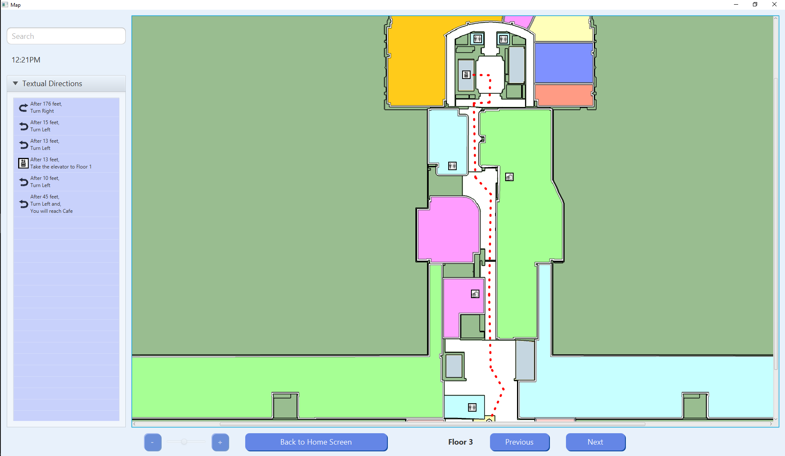

# FaulknerHospitalKiosk

## Kiosk Project for Faulkner Hospital

Kiosk Wayfinder Project for Software Engineering course at WPI.

This is a program for the Faulkner Hospital located in Boston MA. It's to be incorporated in a kiosk for visitors to use in order to aid them in commuting to their destination as finding your way through a hospital may be difficult for some people.  
This program will incorporate the following (but not limited to) features: 
Feature List:  
- Draw a path to your destinations  
- Ability to choose your destinations from a predefined list including bathrooms and food services 
- Ability to search for your destination 
- Choose multiple destinations 
- Print out textual directions so you won't have to remember the path 
- A beautiful and clean interface so that you won't be overwhelmed 
Admin Feature List:
- Use credentials to login
- Ability to add new floors/locations
- Ability to modify current floors/locations
- Ability to choose a starting location
- A beautiful interface to ensure proper management
- A log to store login attempts

Requirements
---
- An IDE capable with Gradle
- Java SDK/JRE 8

Startup Instructions
---
1) Download ZIP
2) Extract files to location.
3) Make sure the folder is named FaulknerHospitalKiosk
4) Open project in IntelliJ
5) Update Gradle Wrapper if required.
6) Traverse to src -> main -> java -> kiosk -> KioskApp.java
7) Run the start() function inside.

